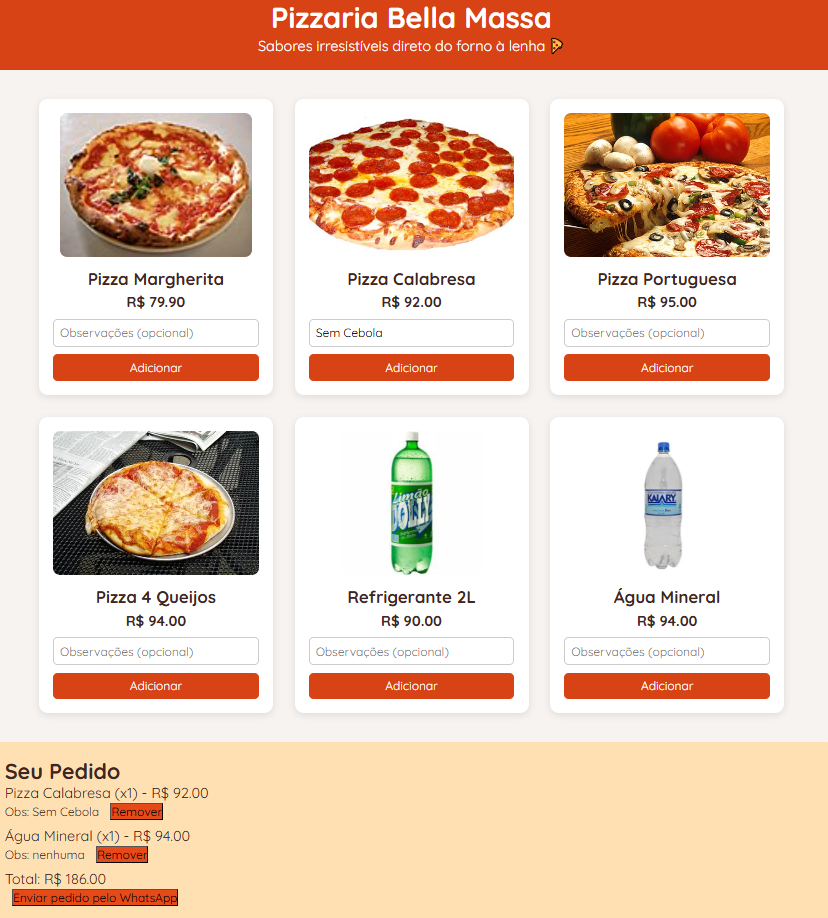

# 🍕 Pizzaria Bella Massa



> Bem-vindo ao repositório da Pizzaria Bella Massa! Este é um website simples e responsivo, focado em permitir que os clientes visualizem o cardápio e façam pedidos de forma prática via WhatsApp.

---

## 🎯 Objetivo

Este projeto serve como **modelo pronto para comercialização** de landing pages personalizadas para negócios locais. Ele pode ser usado como portfólio, vitrine de serviços ou base para entrega a clientes reais.

---

## 📱 Funcionalidades

- ✅ Layout moderno, colorido e atrativo
- ✅ Catálogo de produtos com imagens, nomes e preços
- ✅ Carrinho dinâmico com controle de quantidade e total automático
- ✅ Campo de observações para personalização do pedido
- ✅ Integração com WhatsApp (envio do pedido completo com observações)
- ✅ Design 100% responsivo (funciona perfeitamente no celular, tablet e computador)

---

## 🛠️ Tecnologias Utilizadas

- HTML5 + CSS3
- Tailwind CSS (via CDN)
- JavaScript puro (sem frameworks)
- Google Fonts (Montserrat e Oswald)
- Imagens livres de direitos autorais (Pixabay/Pexels)

---

## 🚀 Como Visualizar

### ✅ Versão ao vivo (GitHub Pages)

👉 [Clique aqui para acessar o site](https://kaique-rocha.github.io/pizzaria-bella-massa/)


### 🧪 Testar localmente

1. Clone o repositório:
```bash
git clone https://github.com/Kaique-Rocha/pizzaria-bella-massa
```
2. Abra o arquivo `index.html` em seu navegador

---

## 🧩 Personalização

### 🔧 Onde alterar os itens do cardápio

No arquivo `index.html`, encontre a seção do JavaScript:
```js
const cardapio = [
  { id: 1, nome: "Pizza Margherita", preco: 79.90, imagem: "./src/img/margherita.jpg" },
  ...
];
```
Você pode adicionar, remover ou editar os produtos conforme o cardápio real do cliente.

### 📲 Onde alterar o número do WhatsApp

No final do código, altere:
```js
const whatsapp = "5511995481647"; // Substitua com o número do cliente (com DDD)
```

---

## 📦 Estrutura de Pastas

```
/
├── index.html
├── src/
│   └── img/
│       ├── 4queijos.webp
│       ├── agua.jpg
│       ├── calabresa.jpg
│       └── ... outras imagens
```

---

## 📣 Quer um site como este?

Entre em contato para contratar a criação de uma landing page personalizada para o seu negócio ou cliente:

📧 **kaiquerocha1805@gmail.com**  
📱 WhatsApp: [Clique para conversar](https://wa.me/+5511995481647)  


---

## 🪪 Licença

Este projeto está disponível apenas como **demo comercial**. Para uso em produção ou comercialização, entre em contato com o autor para personalização profissional.

---

## 👨‍💻 Autor

Desenvolvido com 💻 e 🍔 por **[Kaique Rocha]**

---

